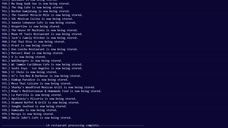
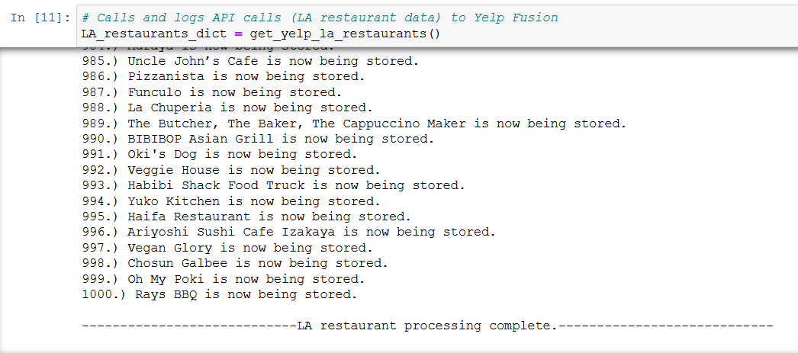
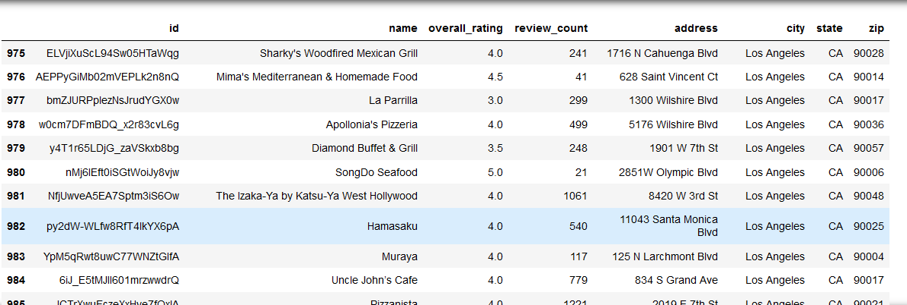
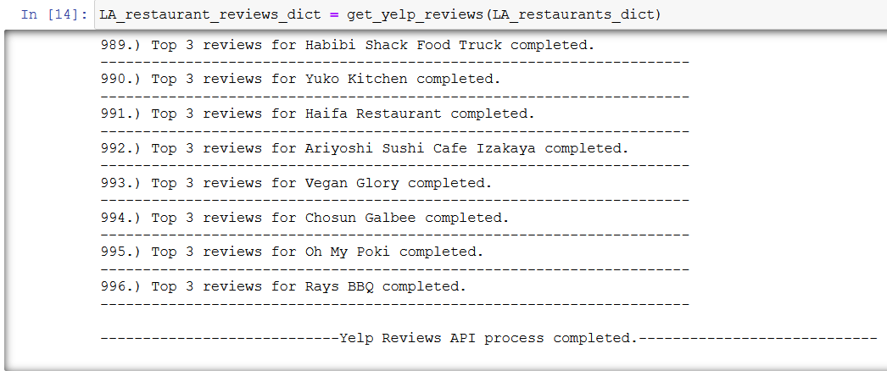
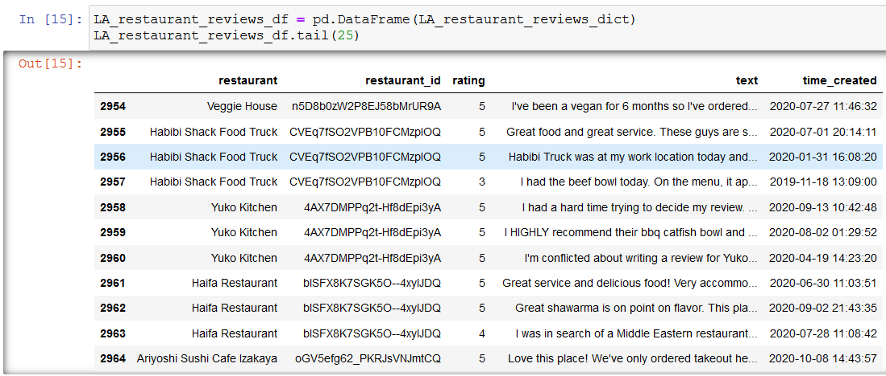

# YelpETL
Scripts to extract, transform, and load Los Angeles Yelp data from the Yelp Fusion API and Kaggle. The process takes place in three Jupyter Notebooks, ultimately culminating in our data being persisted in a MySQL / SQLite database.

*This was a group project at Washington University's Data Analytics Boot Camp (2019)*

### Team
* Heather Leek
* Theodore Moreland
* Adam Feldstein

## Data Sources / Extract
* https://www.yelp.com/fusion
* https://www.kaggle.com/cityofLA/la-restaurant-market-health-data

## Transformations
General data cleaning such as standardizing postal codes.

## SQL Tables / Load

### Restaurant Inspection Data Table:        
    Restaurant Name
    Restaurant Address
    Restaurant City
    Restaurant State
    Restaurant Zip
    Health Inspection Score
    Health Inspection Grade

### Yelp Restaurant Data Table 
    Business ID
    Business Name
    Business Address
    Business City
    Business State
    Business Zip

### Yelp Review Data Table
    Business ID
    Star Rating
    Review data 

# Screenshots

# Python terminal processing restaurants from Yelp Fusion API calls

# Python terminal processing reviews from Yelp Fusion API calls

# Jupyter Notebook finished processing restaurants

# Pandas restaurants dataframe 

# Jupyter Notebook finished processing reviews

# Pandas reviews dataframe 
